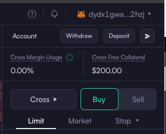

## Instructions

IMPORTANT - If you are in a country which does NOT permit trading with DYDX (such as the UK currently),
for learning purposes, technically a VPN will solve the problem and interacting with Testnet will work.
However, this is not something which we can recommend.

Below examples of DYDX working code if needed
Examples: https://github.com/dydxprotocol/v4-clients/blob/main/v4-client-py-v2/examples/markets_endpoints.py
Official Docs: https://docs.dydx.exchange

NOTE - At the time of upgrading this code, the DYDX website documentation appears out-of-date

DYDX have changed their API since the original course was made
The only code which changes vs the videos are that which sends orders and queries with the DYDX exchange
Otherwise the logic remains the same
The program folder code has been updated to work with DYDX V4

### DYDX Account Setup

1 - Sign into your MetaMask Wallet

2 - Connect to Sepolia Network and send yourself testnet ETH

3 - Visit Testnet Platform: https://v4.testnet.dydx.exchange/trade

4 - Click Recover Keys

5 - If you have no funds, you should be prompted to deposit some pretend trading funds

Your account should look like this



6 - Click on your account at the top right and copy the DYDX address for the ENVIRONMENT VARIABLES described below

### PYTHON SETUP

Ensure you are using Python version 3.12.4 or higher to get exact like-for-like experience.

### SETUP VIRTUAL ENVIRONMENT

Change directory into program folder

```shell
cd program
```

Create virtual environment. Use pip or pip3 and python or python3 depending on your setup.

```shell
python3 -m venv venv
pip3 install --upgrade pip

# MacOS Users
source venv/bin/activate

# Windows Users
venv\Scripts\activate
```

### INSTALL PACKAGES

```shell
python3 -m venv venv
pip3 install -r requirements.txt
```

### ENVIRONMENT VARIABLES

Create a .env file (within program folder)

```shell
touch .env
```

Save your information per the above in the .env file:

```conf
DYDX_ADDRESS = "<dydx1 ENTER YOUR TEST ADDRESS>"
SECRET_PHRASE = "a bunch of your words"
```

Later in the course, save your Telegram token and chat ID in the .env:

```conf
TELEGRAM_TOKEN = "ENTER YOUR TOKEN: will look something like 5860211111:AAGABUQiYet-jI9txy20-hCEgt7NypNwUI"
TELEGRAM_CHAT_ID = "ENTER YOUR CHAT ID: 5236746578"
```

Save ethereum address in the .env:

```conf
ETHEREUM_ADDRESS="YOUR PUBLIC !!! NOT PRIVATE !!! ETHEREUM ADDRESS STARTING WITH 0x 0x0d0..."
```

### RUN CODE

```shell
cd program # if not already in program folder
python3 main.py
```
